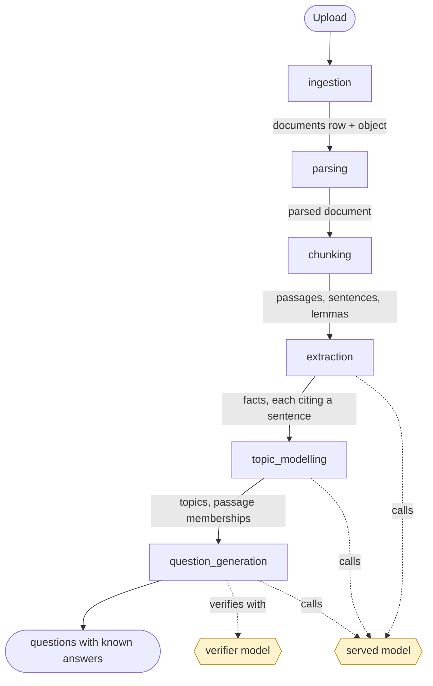
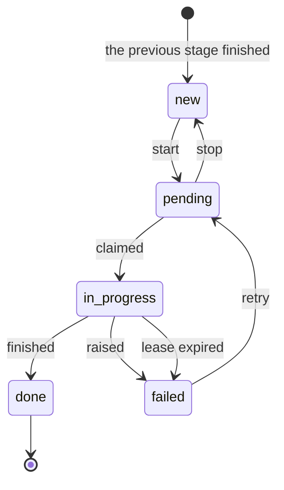
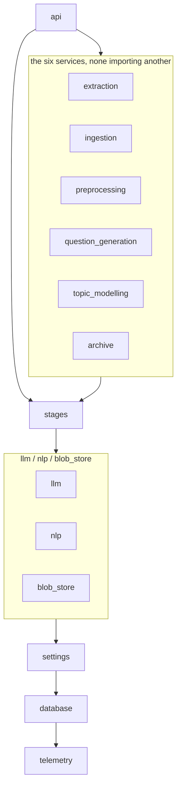

# Architecture

The graph, and what moves along it. Every package documents itself beside its
code; this is the one page that puts them in the same picture.

Four graphs, and they are different graphs: what a document becomes, what a
worker does with one row, what a module may import, and what runs in a
container. Confusing them is the usual way to get lost here.

## 1. What a document becomes

Six packages, in the order a document moves. Each writes its own tables and
reads the previous one's.



**Three of the six call a model**, and they are the slow ones. The other
three are deterministic and cost only CPU.

### What each stage reads and writes

| Stage | Claims | Reads | Writes | Done value |
|---|---|---|---|---|
| `parsing` | `documents.parse_status` | the stored object | parsed document, `parsed` bucket | `parsed` |
| `chunking` | `documents.chunk_status` | the parsed document | `passages` | `chunked` |
| `extraction` | `passages.extract_status` | one passage | `facts`, `fact_passages` | `extracted` |
| `topic_modelling` | `topics.status` | every passage's vocabulary | `topics`, `passage_topics` | `modelled` |
| `question_generation` | `topics.question_status` | one topic's facts | `questions`, `question_facts` | `generated` |

Ingestion is not in that table because it owns no queue: an upload is a
request that writes a row and an object, and parsing is what is then asked
to run.

**A stage selects on its own status column and on nothing else.** Chunking
never reads `parse_status`. That is what lets parsing and chunking own
different columns of the same `documents` row without either knowing the
other exists — and it is why two stages are never "connected" in code, only
through a column.

### The four buckets

`documents`, `parsed`, `export`, `archive` — `S3_BUCKETS` in `.env`. The
originals go in the first, the converter's output in the second, a release
in the third, and what a deletion left behind in the fourth. See
[`backend/blob_store/`](../backend/blob_store/README.md).

## 2. What a worker does with one row

The same queue for all five stages, written once in
[`backend/stages/`](../backend/stages/README.md).



**Nothing starts by itself.** A row arrives `new`, which no worker looks at.
Only `pending` is claimed, so a stage finishing never sets the next one
going — somebody does: the Start button, the route, a `make …-start`, or the
[orchestrator](../orchestration/README.md).

Claiming is `SELECT … FOR UPDATE SKIP LOCKED`, one row at a time, which is
the whole of the horizontal-scaling story:

```bash
podman compose up -d --scale extract-worker=4
```

Every claim is timestamped and every lease is *derived* from what the stage
costs rather than guessed — extraction's from `LLM_TIMEOUT_SECONDS` ×
`LLM_MAX_ATTEMPTS`. A row a worker died holding is failed by the next run of
that stage, then `retry` returns it. **There is no state a row can reach
that nothing can move it out of.**

## 3. What a module may import

Enforced by [`.importlinter`](../.importlinter), not merely intended. Run
`make lint-imports`. Higher may import lower; nothing imports upward.



Two contracts hold this up:

| Contract | Says |
|---|---|
| `layers` | A stage sits above what it shares and below nothing but the api |
| `stages-are-independent` | No backend service imports another |

There is **one upward edge**, and it is argued for in the file:
`settings.changes` imports each service's `config` submodule — never a
service, never a repository — because refusing a setting that would stop a
service means calling that service's own `Settings.load`.

### Why a service package re-exports nothing

A caller names the submodule it wants — `from extraction.repository import
PassageQueue` — so it pays for that submodule and no more. That is what keeps
litellm, Docling, gensim and spaCy out of the **api process**, which loads
none of them despite sharing one image with all five workers.

The import contracts cannot check that on their own: grimp counts imports
inside function bodies, and a deferred import is exactly how the topic
service keeps pyLDAvis out of everything else.
[`tests/static/test_api_stays_light.py`](../tests/static/test_api_stays_light.py)
is what checks it, by reading the api's imports as syntax.

## 4. What runs in a container


The frontend talks only to the api. **No document content leaves the
deployment** — the served model is the one outbound call, and a local one
makes even that internal.

`make services` asks the api which of these are listening and where to open
them; `make open` does that and opens the application.

### The same stage, run on the host

A worker container is not the only way to drain a queue. `make extract`,
`make topics` and `make questions` run the identical code in a host process
against the same database, and the Makefile sources the same files compose
hands the containers, so one value reaches both.

That is not only a convenience. **Some credentials exist only where a
person is** — an interactive cloud login, a key in a login keychain — and a
provider that needs one is a provider the containers cannot use while the
host can. `LLM_CONTAINER_MODEL` is the split that follows: the containers
call a model they can authenticate to, the host calls the one it can, and
both drain the same queues at once because claiming is
`FOR UPDATE SKIP LOCKED`. Two halves of one corpus, not an A/B — comparing
two models means running them over the *same* rows under two `RUN_ID`s.

A worker proves its model answers before it claims anything, so the half
that cannot authenticate stops instead of failing rows. See
[`backend/llm/`](../backend/llm/README.md#a-worker-proves-the-model-before-it-claims-anything).

There is no difference in what it is watched with. `LOG_DIR` names `./logs`
on the host and the `logs` volume in a container — one name, set over in
compose, the way the OTLP endpoint and Phoenix's API are — and filebeat
reads both directories into the same data stream. So a host drain's lines
land in Grafana beside a worker's, joined to the same trace, and
`host.name` is what tells a machine from a container id.

## 5. Where the signals go

Each of these sees the whole pipeline and none of them sees it the way
another does. Nothing is collected twice on one path, and no service stores
what belongs to another.

| Signal | Path | Read with |
|---|---|---|
| Logs | process → the `logs` volume in a container, `./logs` on the host (JSON, ECS fields) → Filebeat → Elasticsearch | Grafana, `make logs` |
| Traces | process → OTLP → Phoenix, one project per `<stage>-<run id>` | Phoenix |
| Cost and tokens | on the span, and on the log line beside it | Phoenix per run; Grafana's throughput dashboard over time; `make spend LOG=` over a captured log |
| Gate verdicts | the row in Postgres, an attribute on the span, and one annotation per gate that read it | the Questions page; Phoenix's Evaluations view, a column per gate |
| The join between them | `questions.trace_id` and `questions.span_id`, written where the gates run | the Questions page links to the span and the trace; Phoenix resolves either from the bare id |
| Prompts | composed in the source, recorded to the `prompts` table by the stage that sends them, and on each span as the text it sent | the Questions page; `GET /prompts`; Phoenix after `make prompts-publish` |
| Scores | golden cases run against the served model | `make eval-score`, Phoenix |
| Human review | Postgres → a disposable copy in Argilla → the answers back | Argilla, `make review-*` |
| Runs | which stage ran when, and whether it finished | Dagster |
| State | the tables themselves — what is true now, rather than what happened once | Grafana's state dashboard, the pipeline pages |

A slow extraction is one span in Phoenix and a set of lines in Grafana,
findable from either end: `trace.id` is on every log line and is the join.
See [`telemetry/`](../telemetry/README.md).

Cost is the one figure in two stores on purpose. The span is what makes it
comparable per run and per judgement; the log line is what makes it readable
when the collector is down or was never configured.

**Nothing is deleted until `make logs-retention` and `make logs-prune` have
run.** The first ages the Elasticsearch index, the second the files — both
directories — the shipper read them out of. That is the state the stack
ships in, deliberately.

## 6. Where to change things

| To change | Go to |
|---|---|
| Any behaviour setting | [`backend/settings/catalog.py`](../backend/settings/catalog.py) — one declaration, then the UI, API and CLI all offer it |
| Which model, or which provider | `LLM_MODEL` in `.env`; credentials in `configs/env/provider.env` |
| Credentials, ports, addresses | `.env` |
| How the pipeline behaves, by default | `configs/env/backend.env` |
| What a stage does | that stage's package, and nothing else |

A setting is declared **once**. The catalogue entry is what puts it on the
service's Configuration panel, in `GET /settings/{service}` and in
`make settings SERVICE=…`; two static tests refuse a setting the code reads
and the catalogue omits, and a catalogue entry nothing reads. See
[configuration.md](configuration.md).

## What keeps this page true

| Claim here | Checked by |
|---|---|
| The layer order and the independence rule | `make lint-imports` |
| The layers named above match the contracts | `tests/static/test_architecture.py` |
| The api loads no model or converter | `tests/static/test_api_stays_light.py` |
| Every setting is declared once and read | `tests/static/test_settings_catalogued.py` |
| The dashboards match the fields that serve them | `tests/static/test_dashboards.py` |
| Every relative link on any of these pages resolves | `tests/static/test_doc_links.py` |

The diagrams are prose and can still drift. The layer list is the part most
worth pinning, because it is the one a normal-looking edit breaks.
