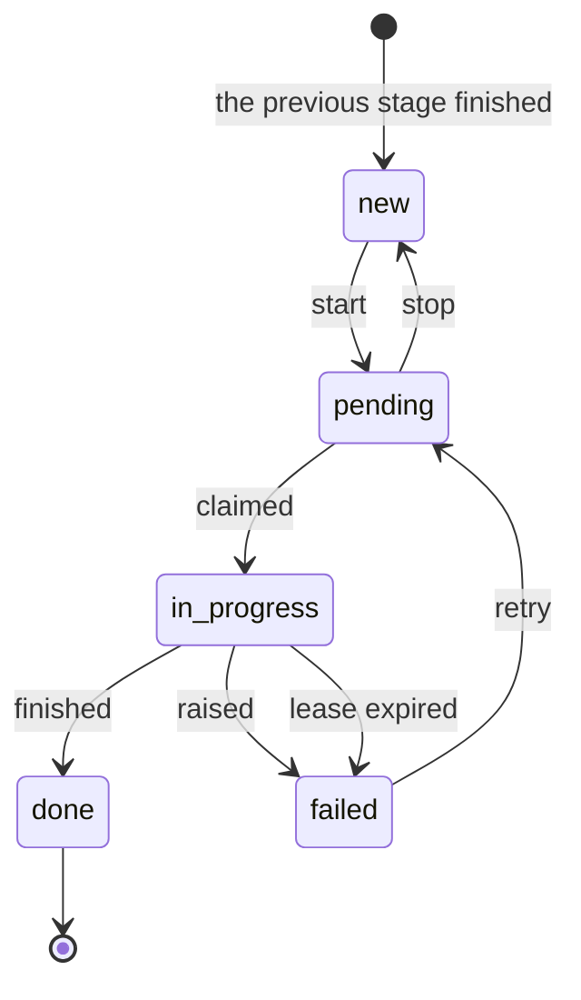
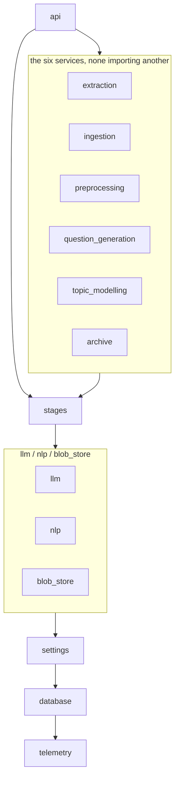
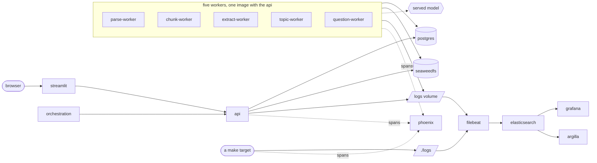

# Architecture

Four graphs: what a document becomes, what a worker does with one row, what a
module may import, and what runs in a container.

## 1. What a document becomes

Six packages, in the order a document moves. Each writes its own tables and
reads the previous one's.


| Stage | Claims | Reads | Writes | Done value |
|---|---|---|---|---|
| `parsing` | `documents.parse_status` | the stored object | parsed document, `parsed` bucket | `parsed` |
| `chunking` | `documents.chunk_status` | the parsed document | `passages` | `chunked` |
| `extraction` | `passages.extract_status` | one passage | `facts`, `fact_passages` | `extracted` |
| `topic_modelling` | `topics.status` | every passage's vocabulary | `topics`, `passage_topics` | `modelled` |
| `question_generation` | `topics.question_status` | one topic's facts | `questions`, `question_facts` | `generated` |

Ingestion owns no queue: an upload writes a row and an object, and parsing is
what is then asked to run.

A stage selects on its own status column and on nothing else. Chunking never
reads `parse_status`, which is how parsing and chunking own different columns
of the same `documents` row.

The four buckets are `documents`, `parsed`, `export` and `archive` —
`S3_BUCKETS` in `.env`. See
[`backend/blob_store/`](../backend/blob_store/README.md).

## 2. What a worker does with one row

The same queue for all five stages, written once in
[`backend/stages/`](../backend/stages/README.md).



A row arrives `new`, which no worker looks at. Only `pending` is claimed, so
nothing starts by itself — the Start button, a route, a `make …-start` or the
[orchestrator](../orchestration/README.md) moves it.

Claiming is `SELECT … FOR UPDATE SKIP LOCKED`, one row at a time:

```bash
podman compose up -d --scale extract-worker=4
```

Every claim is timestamped and every lease is derived from what the stage
costs — extraction's from `LLM_TIMEOUT_SECONDS` × `LLM_MAX_ATTEMPTS`. A row a
worker died holding is failed by the next run of that stage, and `retry`
returns it.

## 3. What a module may import

Enforced by [`.importlinter`](../.importlinter). Run `make lint-imports`.
Higher may import lower; nothing imports upward.



| Contract | Says |
|---|---|
| `layers` | A stage sits above what it shares and below nothing but the api |
| `stages-are-independent` | No backend service imports another |

There is one upward edge: `settings.changes` imports each service's `config`
submodule, because refusing a setting that would stop a service means calling
that service's own `Settings.load`.

A service package re-exports nothing, so a caller naming
`extraction.repository` pays for that submodule and no more. The contracts
cannot check that on their own — grimp counts imports inside function bodies,
and a deferred import is how the topic service keeps pyLDAvis out of
everything else.
[`tests/static/test_api_stays_light.py`](../tests/static/test_api_stays_light.py)
is what checks it.

## 4. What runs in a container



The frontend talks only to the api. The served model is the one outbound
call, and a local one makes even that internal.

`make services` asks the api which of these are listening; `make open` opens
the application.

### The same stage, run on the host

`make extract`, `make topics` and `make questions` run the identical code in
a host process against the same database, and the Makefile sources the same
files compose hands the containers.

Some credentials exist only where a person is — an interactive cloud login, a
key in a login keychain — and a container holds none of them.
`LLM_CONTAINER_MODEL` is the split: the containers call a model they can
authenticate to, the host calls the one it can, and both drain the same
queues because claiming is `FOR UPDATE SKIP LOCKED`. That is two halves of
one corpus, not an A/B — comparing two models means running them over the
same rows under two `RUN_ID`s.

`LOG_DIR` names `./logs` on the host and the `logs` volume in a container,
and filebeat reads both into the same data stream. `host.name` tells a
machine from a container id.

## 5. Where the signals go

| Signal | Path | Read with |
|---|---|---|
| Logs | process → `logs` volume or `./logs` (JSON, ECS fields) → Filebeat → Elasticsearch | Grafana, `make logs` |
| Traces | process → OTLP → Phoenix, one project per `<stage>-<run id>` | Phoenix |
| Cost and tokens | on the span, and on the log line beside it | Phoenix, Grafana, `make spend LOG=` |
| Gate verdicts | the row in Postgres, an attribute on the span, one annotation per gate | the Questions page, Phoenix's Evaluations view |
| The join between them | `questions.trace_id` and `questions.span_id` | the Questions page links to both |
| Prompts | composed in the source, recorded to the `prompts` table, and on each span | the Questions page, `GET /prompts`, Phoenix after `make prompts-publish` |
| Scores | golden cases run against the served model | `make eval-score`, Phoenix |
| Human review | Postgres → a disposable copy in Argilla → the answers back | Argilla, `make review-*` |
| Runs | which stage ran when | Dagster |
| State | the tables themselves | Grafana's state dashboard, the pipeline pages |

`trace.id` is on every log line and is the join between a span and its lines.
See [`telemetry/`](../telemetry/README.md).

Nothing is deleted until `make logs-retention` and `make logs-prune` have
run. The first ages the Elasticsearch index, the second the files.

## 6. Where to change things

| To change | Go to |
|---|---|
| Any behaviour setting | [`backend/settings/catalog.py`](../backend/settings/catalog.py) |
| Which model, or which provider | `LLM_MODEL` in `.env`; credentials in `configs/env/provider.env` |
| Credentials, ports, addresses | `.env` |
| How the pipeline behaves, by default | `configs/env/backend.env` |
| What a stage does | that stage's package, and nothing else |

A setting is declared once. Two static tests refuse a setting the code reads
and the catalogue omits, and a catalogue entry nothing reads. See
[configuration.md](configuration.md).

## What keeps this page true

| Claim | Checked by |
|---|---|
| The layer order and the independence rule | `make lint-imports` |
| The layers named here match the contracts | `tests/static/test_architecture.py` |
| The api loads no model or converter | `tests/static/test_api_stays_light.py` |
| Every setting is declared once and read | `tests/static/test_settings_catalogued.py` |
| The dashboards match the fields that serve them | `tests/static/test_dashboards.py` |
| Every relative link on these pages resolves | `tests/static/test_doc_links.py` |
